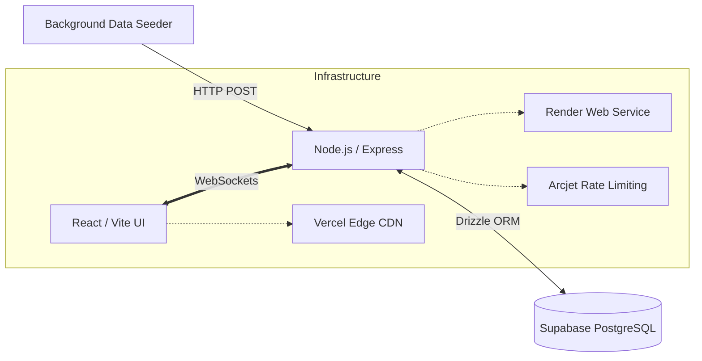

# ⚽ Sportz: Real-Time Event Dashboard

> **Live Production URL:** [https://sportz-frontend-main.vercel.app](https://sportz-rho.vercel.app) 


## 📋 Overview
Sportz is a high-performance, real-time sports dashboard engineered to demonstrate bi-directional data streaming and decoupled enterprise architecture. It simulates a live-feed environment where high-frequency match events, scores, and commentary are pushed continuously to clients with sub-second latency.

Instead of relying on heavy Long-Polling or Server-Sent Events (SSE), this project utilizes native **WebSockets** for a persistent, low-overhead TCP connection, allowing the backend to actively broadcast payload mutations immediately upon database insertion.

---

## 🏗️ System Architecture



### 1. Data Ingestion (The Worker)
To simulate the behavior of a 3rd-party webhook (e.g., Sportradar), a standalone Node.js background process boots up alongside the main Express server. This worker rapidly generates simulated events and dispatches POST requests to the backend REST API, emulating a decoupled microservice ingestion pipeline.

### 2. State & Persistence (The Database)
- **Supabase (PostgreSQL):** Utilized exclusively as a headless connection pooler (PgBouncer) to handle concurrent high-frequency transactions.
- **Drizzle ORM:** Defines a strict, Code-First infrastructure ensuring end-to-end type safety between the TypeScript schemas and the Postgres execution layer.

### 3. Real-Time Broadcast (The Server)
- The Node.js Express server is tightly coupled with a `ws` WebSocket Server. 
- The moment the Data Worker commits a payload to the database via REST, the server detects the mutation and instantly broadcasts a targeted WebSocket frame (`score_update` or `commentary`) to all connected clients.
- Protected by **Arcjet** security middleware to prevent bot floods and DDoS attacks on the WebSocket handshake.

### 4. Client Hydration (The UI)
- The frontend is a highly reactive Vite application.
- On mount, it fetches the initial hydration state via a traditional `GET` request, and subsequently opens a persistent WebSocket channel listener. React hooks dynamically intercept incoming frames and update the UI instantly without ever requiring a browser refresh.

---

## 🛠️ Key Engineering Decisions

1. **Why WebSockets over Polling?**  
   Polling the database every 2 seconds for live changes drains connection pools and kills server CPU. WebSockets eliminate HTTP overhead by establishing a persistent TCP connection, turning the architecture from *"Pull-based"* to *"Push-based"*.

2. **Why Drizzle ORM over Prisma?**  
   Prisma operates via a Rust-based query engine which can introduce cold-boot latency on serverless edge functions. Drizzle compiles directly to raw SQL at runtime, drastically improving query resolution speeds which is mission-critical for a high-frequency real-time app.

3. **Decoupled CI/CD infrastructure:**  
   The project is intentionally split into two distinct runtimes (`sportz-frontend-main` and `sportz-websockets-main`) housed within a monorepo. This achieves strict separation of concerns, native GitHub Actions CI testing across varied environments, and allows horizontal scaling of the Node server independent of the React CDN edge network.

---

## 🚀 Running Locally

### Prerequisites
- Node.js (v20+)
- PostgreSQL Database URL

### 1. Backend Setup
```bash
cd sportz-websockets-main
npm install
# Configure your .env with DATABASE_URL, ARCJET_KEY, and ARCJET_ENV="development"
npm run db:push
npm run dev
```

### 2. Frontend Setup (In a new terminal)
```bash
cd sportz-frontend-main
npm install
# Configure your .env with VITE_API_BASE_URL and VITE_WS_BASE_URL (pointing to localhost)
npm run dev
```
